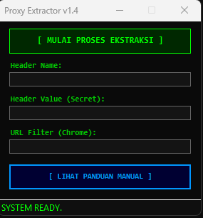
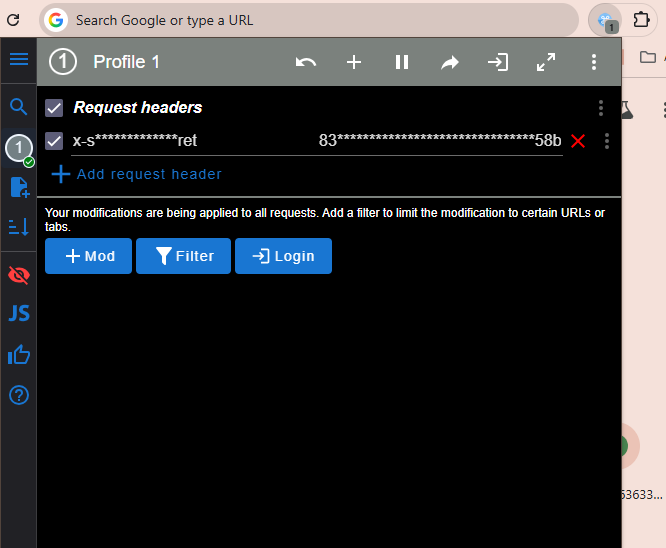

# 🚀 ProxyExtractor

Aplikasi extractor otomatis untuk menyalin parameter proxy rahasia dari memori sistem ke browser Google Chrome Anda.

---

## 🛠️ Langkah Penggunaan & Setup Manual

Ikuti langkah-langkah mudah di bawah ini untuk mengonfigurasi ekstensi Chrome Anda:

### 1. Install Ekstensi ModHeader
Pastikan Anda sudah mengunduh dan memasang ekstensi resmi ModHeader di browser Google Chrome melalui tautan berikut:
👉 [Download ModHeader - Chrome Web Store](https://chromewebstore.google.com/detail/modheader-modify-http-hea/idgpnmonknjnojddfkpgkljpfnnfcklj)

### 2. Jalankan Aplikasi & Salin Data
1. Jalankan aplikasi **ProxyExtractor** (file `.exe` Anda).
2. Klik tombol **`[ MULAI PROSES EKSTRAKSI ]`** dan tunggu hingga status berubah menjadi sukses.
3. Cukup **klik pada kotak teks hasil** (Header Name, Header Value, atau URL Filter) untuk menyalin datanya ke clipboard secara otomatis.

### 3. Konfigurasi di ModHeader
Buka ekstensi ModHeader di Chrome Anda, lalu masukkan data yang telah disalin sesuai dengan petunjuk visual di bawah ini:

| Komponen di ModHeader | Sumber Data dari Aplikasi | Nilai Bawaan / Contoh |
| :--- | :--- | :--- |
| **Request Headers (Name)** | Kolom *Header Name* | `x-s*********ret` |
| **Request Headers (Value)** | Kolom *Header Value (Secret)* | *(Kode rahasia 64 karakter hex)* |
| **URL Filter** | Kolom *URL Filter (Chrome)* | `https://127.0.0.1:PORT/` |

---

## 📸 Panduan Visual Pengisian

Pastikan penempatan data di dalam ekstensi ModHeader Anda terisi dengan benar. Silakan klik tombol di bawah ini untuk melihat panduan gambar:

### 🖥️ 1. Posisi Input Header & Value (Aplikasi vs ModHeader)

  
🔍 Klik di sini untuk melihat/menyembunyikan gambar

   
  

    
  

 

### 🌐 2. Hasil Akhir Konfigurasi ModHeader yang Benar

  
🔍 Klik di sini untuk melihat/menyembunyikan gambar

   
  

    
  

 

> ⚠️ **PENTING:** Pastikan Anda memberikan tanda centang `[✓]` di sebelah kiri nama **Request headers**, **x-sb-proxy-secret**, dan **URL Filter** agar modifikasi request berjalan dengan sempurna di browser Anda.
